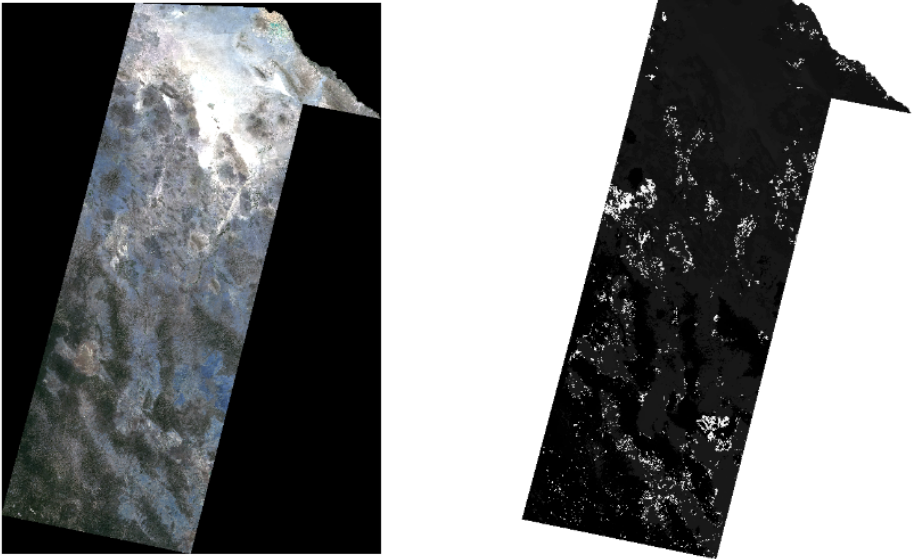
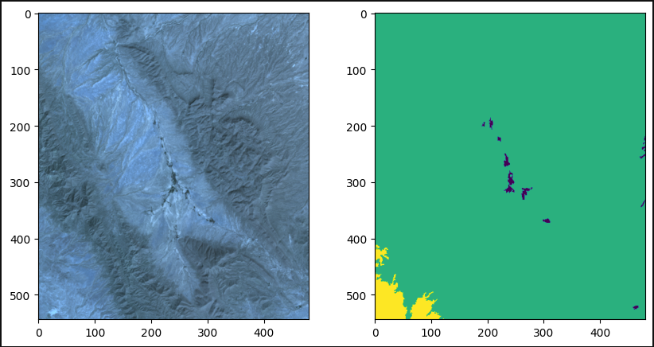
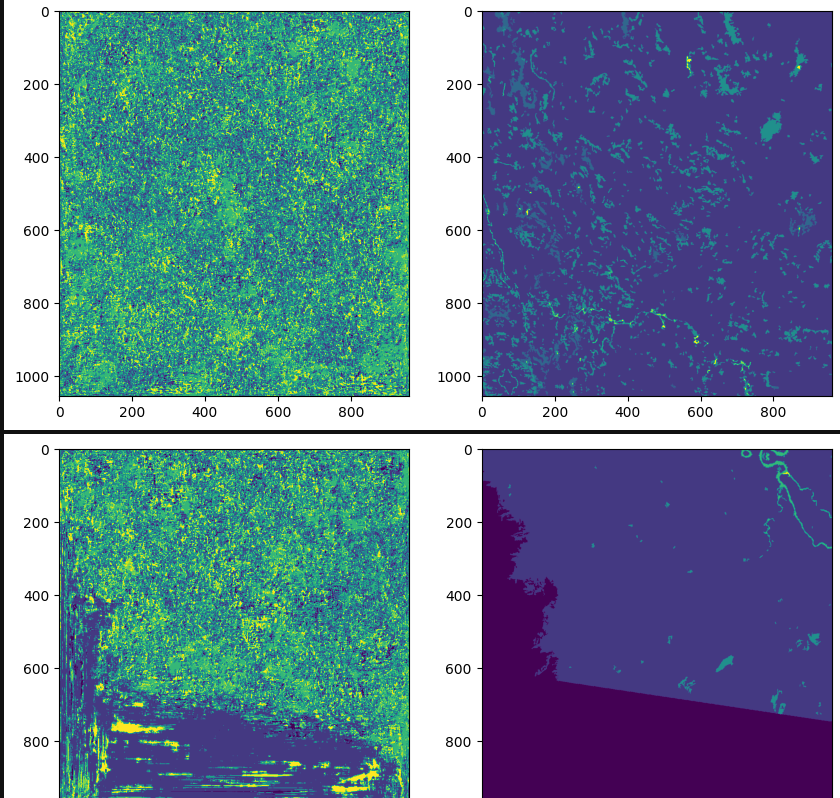
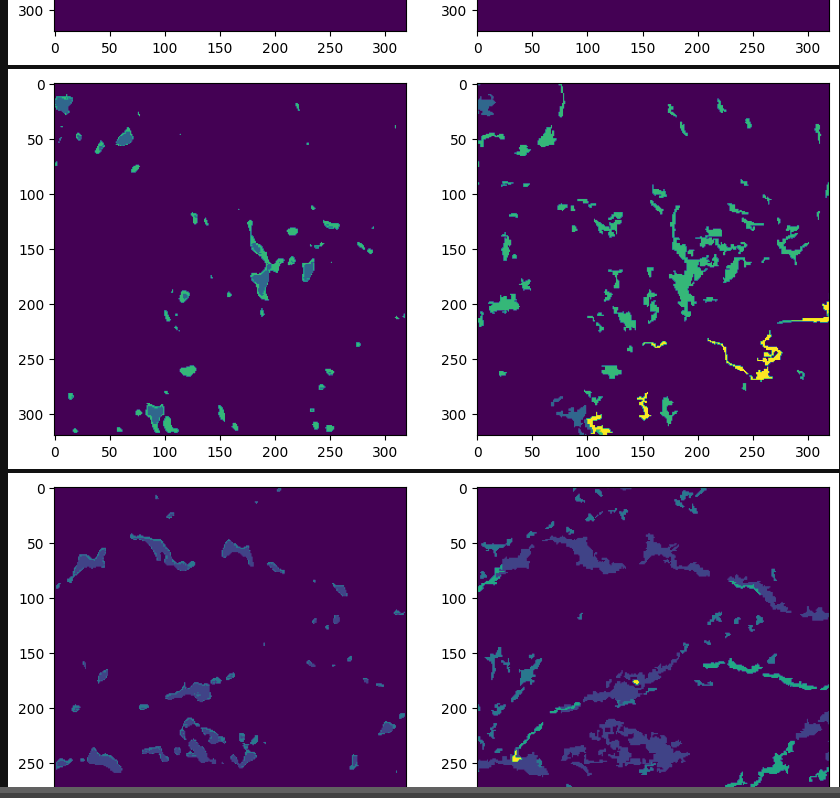
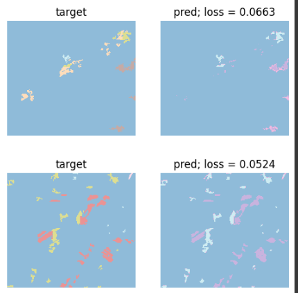
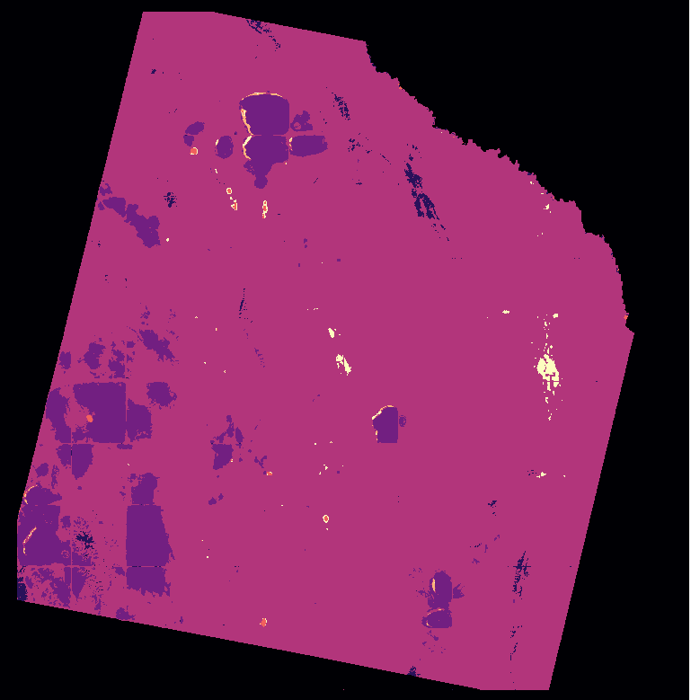

# Wall to Wall

**Author:** Kevin Saúl Gómez Molina  
**Email:** [gomosak@outlook.es](mailto:gomosak@outlook.es)  

If you have any questions or need further assistance with this project, feel free to reach out via any of the contact options above.

---

Note: All the code provided below is in an experimental phase; therefore, it must be used with caution.

In this section, We will present some images demonstrating both the best and worst results of the models.

### Example Showcase:

Our example starts with the image and its corresponding mask, where each pixel in the mask holds the value of its corresponding pixel in the image. The mask represents the classification of the image. Therefore, the objective is to train a model to predict the classification for each pixel in the images.

Then, we proceed to construct batches to accelerate processing using GPU. For this purpose, I've developed a class to manage images consisting of 6 bands along with their corresponding masks. Each image has a size of 256x256 pixels. Considering the available resources, We create batches containing 4 images. Additionally, I've incorporated some basic transformations such as rotation, vertical flipping, zoom, and brightness adjustment to enhance the completeness of the dataset. However, there is pot 
ential to apply more sophisticated transformations.

We have experimented with various model architectures, such as ResNet, FPN, and UnetPlusPlus, in order to find the optimal model for the task. To facilitate this process, We utilized the segmentation_models_pytorch library. Additionally, We explored different loss functions, optimizers, and evaluation metrics to assess the performance of the models. Currently, We are employing the MulticlassDiceLoss as the loss function and DiceMulticlass as the metric function. As for optimizers, We opted for a classic one, utilizing the Ranger optimizer.

Here's an example showcasing the comparison between a random prediction (left) and the actual mask image (right):

### Best Model Result:

This image showcases the best result achieved by the model, boasting a remarkable general accuracy of .948:

Other Results:
Here are additional images representing the outcomes of the model:

Image 1:

Image 2:

We have also attempted to enhance the dataset by generating virtual data based on the real data. However, this approach did not yield satisfactory results because the virtual data exhibits a normal distribution, whereas the real data does not. Therefore, my current strategy is to improve the real data by applying transformations.

## Last Result in Chihuahua
We conducted an exercise in the state of Chihuahua using segmented data developed by GTMRSV through CONAFOR. Our preliminary results showed promising patterns; however, the data requires further post-processing to improve its clarity and accuracy. Specifically, one key adjustment will involve filtering out areas smaller than 1 hectare, which can help reduce noise and enhance the precision of the visual output. This step is essential for focusing on meaningful spatial patterns and ensuring that the final image provides a clear and actionable representation of the landscape. This exercise achieved an accuracy of 87% in the initial model. After validation by an expert, the thematic accuracy was confirmed to be 80%. For future work, we aim to implement and adapt this model in diverse ecoregions, such as the Yucatán Peninsula. By expanding to various ecosystems, we hope to test the model’s robustness across different landscapes, refine its predictive capabilities, and enhance its utility for broader environmental applications.We are currently enhancing the input data by incorporating additional layers, such as an elevation model, water mask, and urban area mask, along with specific bands like NDVI. However, to optimize the model, we need to experiment with each new layer to determine which ones add valuable information and which do not. Unfortunately, each experiment requires a full training cycle, so careful selection of data inputs is essential to maximize efficiency and avoid unnecessary computational demands.

